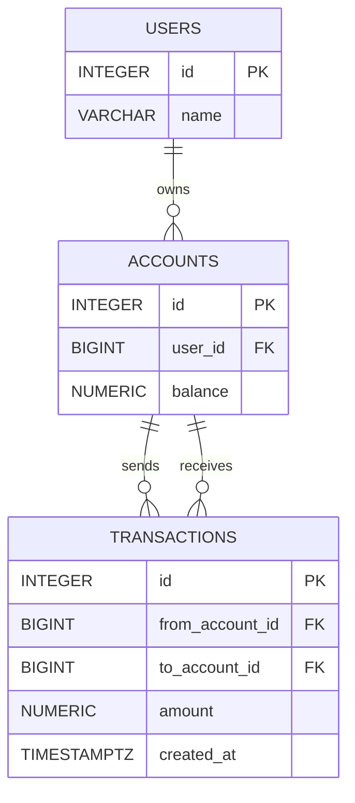

## JDBC Banking System (Java: OpenJDK 25.0.1)

Консольное приложение для управления пользователями, счетами и денежными переводами через JDBC.  
Проект демонстрирует работу с PostgreSQL, `PreparedStatement`, `ResultSet`, генерацией ключей, транзакциями и базовыми CRUD-операциями.

---

## Инструкция

- Перед запуском убедитесь, что установлен и запущен PostgreSQL.
- Создайте базу данных `bank`.
- Внутри базы выполните SQL-скрипт для создания таблиц `users`, `accounts` и `transactions`.
- В файле `db.properties` укажите параметры подключения, например:
    - `db.url=jdbc:postgresql://localhost:5432/bank`
    - `db.user=...`
    - `db.password=...`
- Запустите класс `Main`.

После запуска программа показывает консольное меню, где можно:

- создать пользователя;
- создать счет для пользователя;
- выполнить перевод между счетами;
- вывести список пользователей;
- вывести список счетов;
- вывести историю операций;
- посмотреть баланс счета.

---

## Особенности реализации

- Подключение к БД через `DriverManager`
- Настройки подключения читаются из файла `db.properties`
- Используются `PreparedStatement` и `ResultSet`
- Для операций перевода денег применяется транзакция:
    - `setAutoCommit(false)`
    - `commit()`
    - `rollback()` при ошибке
- Для денежных значений используется `BigDecimal`
- При создании пользователя и счета используется `RETURN_GENERATED_KEYS`
- Логика разделена на:
    - `config` — подключение к БД
    - `model` — сущности
    - `service` — бизнес-логика
    - `util` — утилитные классы
---
## SQL-схема

---

## Возможности проекта

- создание пользователя;
- создание счета;
- перевод денег между счетами;
- проверка баланса;
- вывод всех пользователей;
- вывод всех счетов;
- вывод истории транзакций.

---

## Зависимости

- Java
- PostgreSQL JDBC Driver
- PostgreSQL

---

## Примечания

- Перед выполнением перевода убедитесь, что на исходном счете достаточно средств.
- Если база или таблицы не созданы, приложение завершится с ошибкой подключения или SQL-ошибкой.